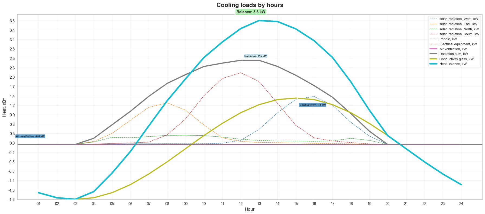
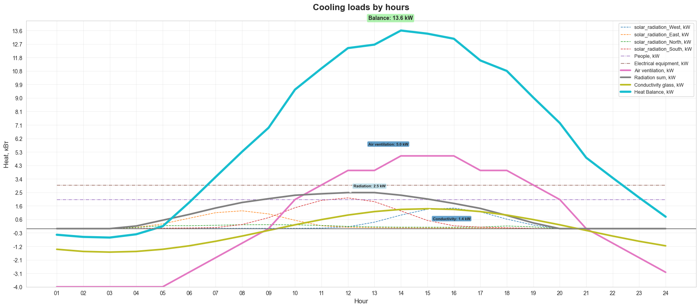

#Инженерные_системы #ОВиК #Нагрузки_на_охлаждение #Автоматизация #Солнечное_теплопоступление #Наука_о_зданиях #Энергоэффективность

Автор: "Донченко Михаил, дата: 2026-04-08

---

В проектах ОВиК (отопление, вентиляция, кондиционирование воздуха) расчёт нагрузок на кондиционирование — сложная, но крайне важная задача. Точные расчёты помогают спроектировать эффективные системы охлаждения, которые поддерживают комфортный микроклимат, минимизируя при этом потребление энергии.

---

**Основные источники теплопоступлений**

Общая нагрузка на охлаждение здания представляет собой сумму теплопоступлений от нескольких источников:
- солнечное излучение через окна;
- тепло, выделяемое людьми;
- тепло от электронного оборудования;
- тепло, генерируемое электрическим освещением.

Эти теплопоступления меняются в течение дня из‑за:
- графиков присутствия людей и уровня их активности;
- положения солнца (высоты и азимута), которое напрямую влияет на интенсивность солнечного излучения.

Для достижения точных результатов инженеры выполняют **почасовые расчёты** для типового дня. Эти данные затем служат основой для проектирования эффективной системы охлаждения.

---
### Практический пример: расчёт для небольшого дома

Рассмотрим небольшой дом со следующими параметрами:
- **Размер окна:** 3 м² на окно.
- **Окна по ориентации:**
    - южная : 20 окон;
    - северная : 20 окон;
    - западная : 10 окон;
    - восточная : 10 окон.
- **Местоположение:** широта 56$\degree$.
- **Количество людей:** 20.
- **Вентиляция:** 20 человек × 60 м³/ч = 1200 м³/ч наружного воздуха.

Ниже приведены ключевые входные параметры, заданные в Python:
```python
t_out_day_mid = 23 # Средняя температура наружного воздуха днём
A_air_day = 24     # Амплитуда температуры наружного воздуха в течение дня

R_value = 1.45    # Значение R (термическое сопротивление) стекла
K1 = 0.9         # Стандартное значение интенсивности прямого солнечного излучения (стекло вертикальное)
K2 = 1           # Стандартное значение интенсивности непрямого солнечного излучения (стекло вертикальное)
K3 = 0.4         # Устройства защиты от солнца
K4 = 0.34/0.87  # Солнечный фактор для стекла, указанный производителем

# Остекление по направлениям
glassing = {
    'w' : 3*10,
    'e' : 3*10,
    'n' : 3*20,
    's' : 3*20,
}
  
Q_people_kW = {'occupancy' : 20}
Q_appliances_kW = {'equipment_load' : 10}   
L_m3_h = 20*60                               # Наружный воздух для вентиляции
```

Мы передаём эти параметры в функцию расчёта:

```python
calculation = Solar_radiation_cooling_load()

calculation.calculate(
    A_m2_w = glassing['w'],
    A_m2_e = glassing['e'],
    A_m2_n = glassing['n'],
    A_m2_s = glassing['s'],
    Q_people_kW = Q_people_kW['occupancy'],
    Q_appliances_kW = Q_appliances_kW['equipment_load'],
    L_m3_h = L_m3_h,
    t_out_day_mid = t_out_day_mid,
    A_air_day = A_air_day,
    R = R_value,
    K1 = K1,  
    K2 = K2,  
    K3 = K3,  
    K4 = K4,
)
```

---
### Результаты
Результаты расчёта представлены в таблице ниже:

| hour | w_Q_sun_kW | e_Q_sun_kW | n_Q_sun_kW | s_Q_sun_kW | Q_people_kW | Rad_kW | Q_conduction_kW | Q_heating_air_kW | Q_sum_kW |
|------|------------|------------|------------|------------|-------------|--------|-----------------|------------------|----------|
| 01   | 0.000      | 0.000      | 0.000      | 0.000      | 2.0         | 0.000  | -1.420          | -4.0             | -0.420   |
| 02   | 0.000      | 0.000      | 0.000      | 0.000      | 2.0         | 0.000  | -1.569          | -4.0             | -0.569   |
| 03   | 0.000      | 0.000      | 0.000      | 0.000      | 2.0         | 0.000  | -1.614          | -4.0             | -0.614   |
| 04   | 0.006      | 0.090      | 0.074      | 0.010      | 2.0         | 0.180  | -1.569          | -4.0             | -0.389   |
| 05   | 0.014      | 0.326      | 0.209      | 0.030      | 2.0         | 0.579  | -1.420          | -4.0             | 0.159    |
| 06   | 0.020      | 0.714      | 0.198      | 0.044      | 2.0         | 0.976  | -1.182          | -3.0             | 1.794    |
| 07   | 0.020      | 1.095      | 0.232      | 0.070      | 2.0         | 1.417  | -0.869          | -2.0             | 3.548    |
| 08   | 0.023      | 1.225      | 0.268      | 0.282      | 2.0         | 1.798  | -0.511          | -1.0             | 5.287    |
| 09   | 0.021      | 1.011      | 0.272      | 0.752      | 2.0         | 2.056  | -0.124          | 0.0              | 6.932    |
| 10   | 0.022      | 0.574      | 0.262      | 1.438      | 2.0         | 2.296  | 0.263           | 2.0              | 9.559    |
| 11   | 0.037      | 0.197      | 0.217      | 1.943      | 2.0         | 2.394  | 0.621           | 3.0              | 11.015   |
| 12   | 0.122      | 0.088      | 0.155      | 2.112      | 2.0         | 2.477  | 0.934           | 4.0              | 12.411   |
| 13   | 0.445      | 0.060      | 0.118      | 1.854      | 2.0         | 2.477  | 1.172           | 4.0              | 12.649   |
| 14   | 0.930      | 0.050      | 0.103      | 1.215      | 2.0         | 2.298  | 1.321           | 5.0              | 13.619   |
| 15   | 1.331      | 0.044      | 0.099      | 0.563      | 2.0         | 2.037  | 1.366           | 5.0              | 13.403   |
| 16   | 1.412      | 0.034      | 0.092      | 0.194      | 2.0         | 1.732  | 1.321           | 5.0              | 13.053   |
| 17   | 1.154      | 0.028      | 0.104      | 0.103      | 2.0         | 1.389  | 1.172           | 4.0              | 11.561   |
| 18   | 0.652      | 0.018      | 0.181      | 0.056      | 2.0         | 0.907  | 0.934           | 4.0              | 10.841   |
| 19   | 0.248      | 0.008      | 0.120      | 0.017      | 2.0         | 0.393  | 0.621           | 3.0              | 9.014    |
| 20   | 0.000      | 0.000      | 0.000      | 0.000      | 2.0         | 0.000  | 0.263           | 2.0              | 7.263    |
| 21   | 0.000      | 0.000      | 0.000      | 0.000      | 2.0         | 0.000  | -0.124          | 0.0              | 4.876    |
| 22   | 0.000      | 0.000      | 0.000      | 0.000      | 2.0         | 0.000  | -0.511          | -1.0             | 3.489    |
| 23   | 0.000      | 0.000      | 0.000      | 0.000      | 2.0         | 0.000  | -0.869          | -2.0             | 2.131    |
| 24   | 0.000      | 0.000      | 0.000      | 0.000      | 2.0         | 0.000  | -1.182          | -3.0             | 0.818    |

### Визуализация результатов

Чтобы лучше понять данные, мы можем представить результаты в виде графиков:



**Рис. 1: Теплопоступления только от солнечного излучения.** Этот график показывает вклад теплопоступлений от солнечного излучения по ориентации (восток, запад, север, юг) и общее теплопоступление от солнца.


**Рис. 2: Общий избыток тепла (солнечное + внутренние источники).** Этот график включает все источники тепла: солнечное излучение, тепло от людей, оборудование, теплопроводность и вентиляцию.

---
### Анализ результатов

Из данных можно выделить несколько важных закономерностей:
- **Ночные часы (21:00–06:00):** нагрузки на охлаждение относительно низкие или даже отрицательные (теплопотери), поскольку солнечного излучения нет, а температура наружного воздуха ниже.
- **Утренние часы (06:00–11:00):** быстрое увеличение нагрузки на охлаждение из‑за повышения температуры наружного воздуха и роста интенсивности солнечного излучения, особенно на восточном и южном фасадах.
- **Пиковые часы (12:00–16:00):** достигается максимальная нагрузка на охлаждение, доходящая до 13,6 кВт в 14:00. Этот пик обусловлен:
    - сильным солнечным излучением на южном фасаде;
    - накопленным теплопоступлением на западном фасаде;
    - высокой температурой наружного воздуха;
    - внутренними теплопоступлениями от людей и оборудования.
- **Вечерние часы (17:00–21:00):** постепенное снижение нагрузки на охлаждение по мере уменьшения солнечного излучения и понижения температуры наружного воздуха.
---

### Практические выводы

Этот пример, хотя и упрощённый, иллюстрирует несколько ключевых моментов для проектирования ОВКВ:
- **Время имеет значение:** пиковая нагрузка на охлаждение не обязательно приходится на самое жаркое время суток, а возникает тогда, когда сочетаются солнечное излучение, внутренние теплопоступления и высокая температура наружного воздуха.
- **Ориентация имеет решающее значение:** ориентация здания существенно влияет на распределение теплопоступлений. Правильный выбор затенения и остекления для разных фасадов может снизить пиковые нагрузки.
- **Автоматизация помогает:** почасовые расчёты необходимы для точности, а их автоматизация экономит значительное время и снижает вероятность ошибок.

---
### Масштабирование для реальных проектов

В реальном проектировании зданий сложность резко возрастает:
- здания делятся на **гидравлические зоны**, **ядра здания** и **отдельные стояки**;
- подача охлаждения может осуществляться от нескольких систем;
- разные зоны имеют различные графики присутствия людей и нагрузки от оборудования.
Для правильного подбора:
- оборудования холодильной станции;
- насосного оборудования для отдельных сетей;
- диаметров трубопроводов;
- стратегий управления,
инженеры должны выполнять аналогичные расчёты для:
- **отдельных зон** (например, офисных помещений, серверных, вестибюлей);
- **компонентов системы** (чиллеров, приточных установок, фанкойлов);
- **всего комплекса зданий** в целом.

---
### Заключение

Хотя наш простой пример демонстрирует базовые принципы, реальное проектирование ОВиК требует сложных инструментов, способных справиться со сложностью современных зданий. Автоматизация — это не просто экономия времени, а создание более устойчивых, комфортных и экономически эффективных сред.

Объединяя лучшие инженерные практики с современной разработкой программного обеспечения, мы можем превратить расчёты нагрузок на охлаждение из утомительной задачи в мощный инструмент проектирования.

---
### Следующие шаги

В следующих публикациях мы углубимся в:
1. **Методологии расчёта:** детальный разбор формул теплопоступлений.
2. **Моделирование солнечного излучения:** алгоритмы для прямого и рассеянного излучения.
3. **Архитектуру программного обеспечения:** как построена и масштабируется система.
4. **Кейс‑стади:** реальные примеры использования инструмента.
5. **Документацию по API:** полное руководство для разработчиков.

---
### Список литературы:

1. Руководство 2.91 к Строительным нормам и правилам (СНиП) 2.04.05‑91 — Расчёт теплопоступлений за счёт солнечного излучения в помещениях, Москва, 1993 г.