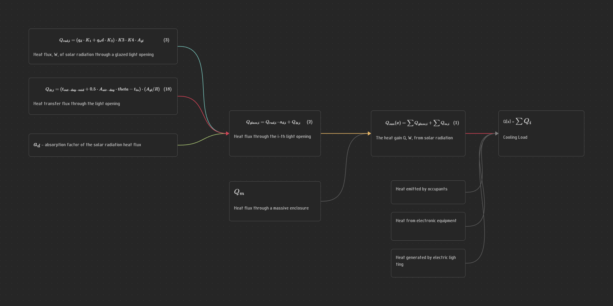
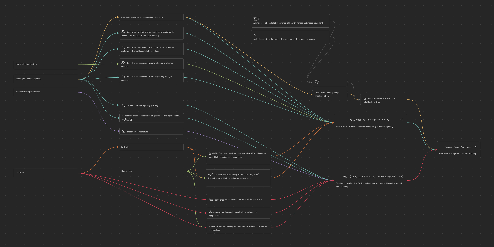
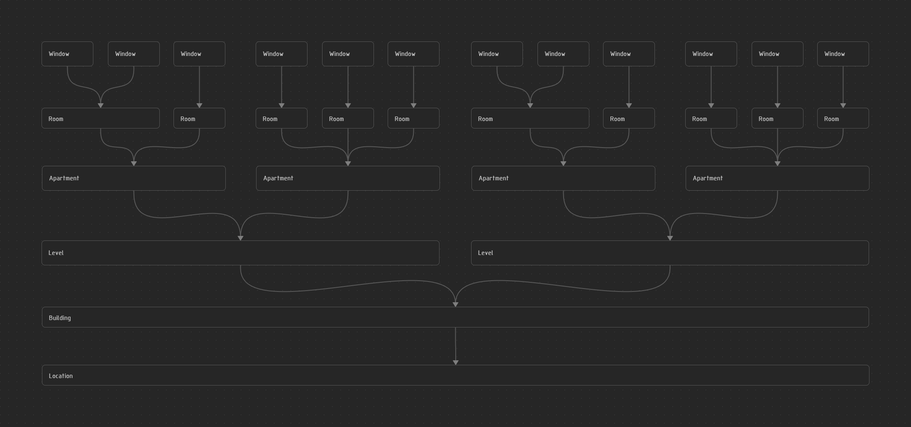
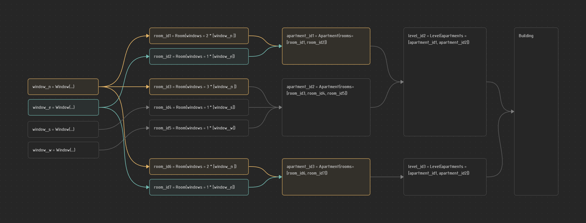
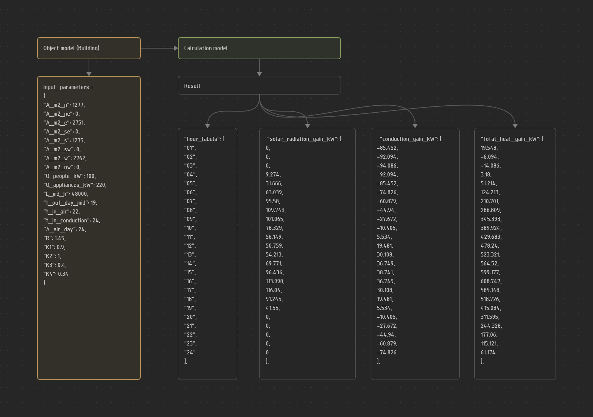
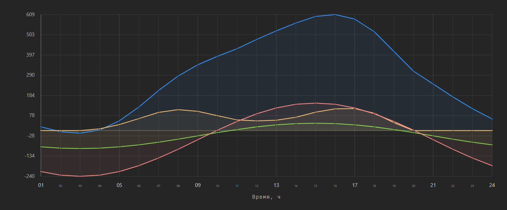

#Engineering #HVAC #CoolingLoads #Engineering #Automation #SolarGain #BuildingScience #EnergyEfficiency

 Autor : Donchenko Michail
 date  : 2026-05-04
email  : michaildonchenko@gmail.com
tg:      :  @donchenko_michail
___ 
## Солнечный тепловой поток в расчетах кондиционирования ОВиК.
Расчет по методике "ПОСОБИЕ 2.91 к СНиП 2.04.05-91 - Расчет поступления теплоты солнечной радиации в помещения". 
Разработка решения по автоматизации расчетов теплопоступлений - часть 1.

---
### <span style="color: orange;">Аннотация </span>

При разработке инженерами-проектировщиками ОВиК систем кондиционирования для различных зданий требуется выполнить расчеты теплопоступлений в помещения от различных источников в т.ч. от солнечной радиации.

Расчет теплопоступлений от солнечной радиации, описанный в [1] достаточно массивный и сложный для выполнения его в табличных программах.
 В результате многие проектировщики прибегают к упрощенным методикам расчета через удельные нагрузки, определенные различными способами, для ускорения расчетов ценой потери физического смысла процесса.
 
Целью данной статьи является привести пример использования средств программирования для решения такой задачи.

Вначале опишем структуру расчета теплопоступлений.
Затем опишем последовательно метод расчета на Python отдельных функций и покажем, как это может в дальнейшем использоваться.

Основные результаты:
- разработана программная реализация алгоритма расчёта теплопоступлений от солнечной радиации;
- показана возможность ускорения расчётов без потери точности;
- предложен подход, сохраняющий физический смысл процесса и позволяющий гибко учитывать исходные параметры.

Практическая значимость работы заключается в предоставлении инженерам‑проектировщикам ОВиК инструмента для быстрого и корректного расчёта теплопоступлений, что повышает точность проектирования систем кондиционирования и снижает риск ошибок на этапе подбора оборудования.

  Ключевые слова: механические системы, ОВиК, проектирование, холодоснабжение, кондиционирование, расчет теплопоступлений, теплопоступления от солнца, автоматизация проектирования, Python.
  
-----
### <span style="color: orange;">Структура статьи</span>

Определим последовательность построения архитектуры расчета и расчетной программы, 
для чего определим:
- метод расчета;
- допущения в текущей редакции расчета; 
- основные сущности;
- параметры основных сущностей, являющиеся входными параметрами расчета и структуру вывода итогов расчета; 
- программную реализацию расчета для различных задач.

---
### <span style="color: orange;">Метод расчета </span>

**Основные источники теплопоступлений**

Общая нагрузка на охлаждение здания представляет собой сумму теплопоступлений от нескольких источников:
- солнечное излучение через окна;
- тепло, выделяемое людьми;
- тепло от электронного оборудования;
- тепло, генерируемое электрическим освещением.

Эти теплопоступления меняются в течение дня из‑за:
- графиков присутствия людей и уровня их активности;
- положения солнца (высоты и азимута), которое напрямую влияет на интенсивность солнечного излучения.

Для достижения точных результатов инженеры выполняют **почасовые расчёты** для типового дня. Эти данные затем служат основой для проектирования эффективной системы охлаждения.

Главную сложность при проведении данного расчета составляет от
определение теплопоступлений от солнечной радиации для светопрозрачных конструкций (окон, фасадных систем) и для массивных конструкций (стены, крыша)  ориентированных на разные стороны для каждого часа в течение суток. 
Мы будем рассматривать именно теплопоступления через остекление, как наиболее влияющее на нагрузку кондиционирование. Расчетом через массивные ограждения в рамках этой работы будем пренебрегать. 

---

  Тепловой поток прямой и рассеянной солнечной радиации (далее "солнечной радиации") через i-й световой остекленный проем (далее "световой проем"), Вт, следует определять по формуле:
$$
Q_{sun} = Q_{sun,i} \cdot a_d + Q_{\delta t} \tag{2}
$$

- $Q_{sun}$ - тепловой поток, Вт, солнечной радиации через остекленный световой проем;
-  a_d - показатель поглощения теплового потока солнечной радиации;
- $Q_{\delta t}$ - тепловой поток теплопередачей через световой проем.

Тепловой поток, Вт, солнечной радиации через световой проем рассчитывается по формуле:
$$
Q_{sun, i} = (q_d \cdot K_1 + q_nd \cdot K_2) \cdot K3 \cdot K4 \cdot A_{gl} \tag{3}
$$
- $q_d, q_nd$ - поверхностная плотность теплового потока, Вт/кв. м, через остекленный световой проем в июле в данный час суток, соответственно от прямой (q_d) и рассеянной (q_nd) солнечной радиации;
- $K_1$ - коэффициенты облученности прямой солнечной радиацией для учета плошали светового проема;
- $K_2$ - коэффициенты облученности д я учета поступления рассеянной солнечной радиации через световые проемы;
- $K_3$ - коэффициенты теплопропускания солнцезащитных устройств;
- $K_4$ - коэффициент теплопропускания остеклением световых проемов;
- $A_{gl}$ - площадь светового проема (остекления), кв. м.

13. Тепловой поток теплопередачей, Вт, для данного часа суток через остекленный световой проем (остекление) рассчитывается по формуле:
$$
Q_{\delta t} = (t_{out-day-mid} + 0.5 \cdot A_{air-day} \cdot \theta - t_{in}) \cdot (F_{m^2} / R) \tag{18}
$$
- $t_{out-day-mid}$ - средняя за сутки температура наружного воздуха, град.С;\
- $A_{air-day}$ - максимальная суточная амплитуда температуры наружного воздуха в июле, град.С;
- $\theta$ - коэффициент, выражающий гармоническое изменение температуры наружного воздуха;
- $t_{in}$ - температура воздуха в помещении, град.С];
- F, R - площадь, кв.м, и;
- R -  приведенное сопротивление теплопередаче остекления светового проема, $m^2С/Вт$.

Изобразим вышеприведенные формулы в виде графа, выделяя интересующие нас составляющие

Pic. 1. Общий граф расчетных формул

Следующим шагом декомпозируем данные формулы на конкретные элементы и параметры

---

Pic. 2. Подробный граф расчета с элементами и параметрами

---
### <span style="color: orange;">Допущения в текущей редакции расчета</span>

В рамках этой работы при описании расчета будут допущены некоторые упрощения. Я сфокусирован на описании и реализации расчета основной значимой части расчета теплопоступлений и расчета нагрузки кондиционирования, которая на мой сегодняшний взгляд кажется достаточной для выполнения инженерных задач. Я буду указывать, чем пренебрегаю в данный момент. В последующих работах, при необходимости, будем уточнять модель расчета для соблюдения всех условий и нюансов автора методики. 

### <span style="color: orange;">Основные сущности</span>

Определим основные элементы и параметры, опишем их формально в виде python классов

```python
from dataclasses import dataclass, field
from typing import Literal

import pandas as pd

Orientation = Literal["nw", "n", "ne", "e", "se", "s", "sw", "w"]

@dataclass
class Window:
    area_sqm: float
    orientation: Orientation
    cooling_load: pd.DataFrame | None = None
    R_value_m2K_W: float = 1.45
    K1: float = 0.9
    K2: float = 1.0
    K3: float = 1.0
    K4_SF_solar_factor: float = 0.34

@dataclass
class Location:
    city_name: str = "Москва"
    latitude: int = 56
    t_out_day_mid: float = 23
    A_air_day: float = 24

@dataclass
class Room:
    number: str
    name: str
    windows: list[Window]
    cooling_load: pd.DataFrame | None = None
    required_air_temperature_C: float = 24
    people_heat_kW: float = 0
    appliances_heat_kW: float = 0
    air_flow_m3_h: float = 0

@dataclass
class Apartment:
    number: str
    rooms: list[Room]
    cooling_load: pd.DataFrame | None = None

@dataclass
class Level:
    number: str
    elevation_m: float
    apartment: list[Apartment]
    cooling_load: pd.DataFrame | None = None

@dataclass
class Building:
    number: str
    name: str
    levels: list[Level]
    location: Location
    cooling_load: pd.DataFrame | None = None

```

Очевидно, что получается структура в виде графа - дерева, в котором элементы являются частью друг друга.

Pic. 3. Граф объектов

Преобразуем нашу модель с учетом ссылочной модели. Светопрозрачные конструкции чаще всего в проекте представлены ограниченным небольших списком одинаковых элементов отличающихся ориентацией по сторонам света. 
Рассчитывая этот конечный список окон далее суммируем теплопоступления через них для определения нагрузки для помещений, далее квартиры, этажа, части здания или целого здания.

Pic. 4. Граф объектов с ссылочной моделью

### <span style="color: orange;">Параметры основных сущностей, являющиеся входными параметрами расчета и структура вывода итогов расчета</span>

Формируем модель расчета с вводимыми параметрами и выходными данными

Pic. 5. Модель расчета с вводимыми и выходными параметрами

Мы получили довольно универсальную модель, позволяющую рассчитывать, как отдельное окно, так и целое помещение, часть здания, или целое здание. 

В соответствии с графом pic.4 мы сможем проводить данный расчет для каждого отдельного окна, и далее суммировать значения по часам для помещения, этажа, здания. 

И получаем наглядный результат в виде графика нагрузок по часам


Pic. 6. Итоговый график нагрузок для здания

желтый - теплопоступления от солнечной радиации;
зеленый - теплопоступления от конвекции остекления;
красный - теплопоступления через окна из за изменяющейся за сутки температуры воздуха;
синий - суммарные теплопоступления; 

Теплопоступления от людей, техники учтены в данном графике, но условно не показаны. 

---
### <span style="color: orange;"> Программная реализация расчета для различных задач </span>

В объеме, описанном в данной статье, я подготовил онлайн программу для выполнения целей: 
1) для работы инженеров в привычном нам формате - онлайн калькулятор для оперативного простого расчета нагрузки на систему холодоснабжения любой отдельной части здания и печати результатов;
2) для развития автоматизации работы инженеров - API для будущего развития платформы с расчетными функциями;

По пункту (1) попробовать можно по ссылке уже сейчас, заполняя форму, как во всех привычных онлайн расчетах: 
https://flairbim.com/calculators/solar_radiation_cooling_load

По пункту (2)  - мы еще будем обсуждать в дальнейших статьях идею и реализацию данного направления, но основная суть в возможности интегрировать этот "расчетный модуль с онлайн API" в различные продукты. Приведу небольшой пример. 

1) автоматизируется получение информации из BIM модели по остеклению целого здания или отдельной части (обновление словаря "parameters");
2) пишется функция запроса параметров к API расчетного модуля с параметрами:

```python
import requests

def send_solar_radiation_request():
    """
    Отправляет GET‑запрос к API для расчёта солнечной радиации.
    Returns:
        dict: Ответ сервера в формате JSON 
        None: В случае ошибки
    """
    url = "https://api.flairbim.com/air_conditioning/calculate_solar_radiation"

	# Параметры запроса (query parameters)
    parameters = {
        "localization": "ru",
        "_A_m2_n": 1277,
        "_A_m2_ne": 0,
        "_A_m2_e": 2751,
        "_A_m2_se": 0,
        "_A_m2_s": 1235,
        "_A_m2_sw": 0,
        "_A_m2_w": 2762,
        "_A_m2_nw": 0,
        "_Q_people_kW": 100,
        "_Q_appliances_kW": 220,
        "_L_m3_h": 48000,
        "_t_out_day_mid": 19,
        "_t_in_air": 22,
        "_t_in_conduction": 24,
        "_A_air_day": 24,
        "_R": 1.45,
        "_K1": 0.9,
        "_K2": 1,
        "_K3": 0.4,
        "_K4": 0.34
    }
    try:
        # Отправка GET‑запроса с параметрами
        response = requests.get(
            url,
            params=parameters,
            timeout=30  
        )
        if response.status_code == 200:
            print("Запрос успешен. Статус кода:", response.status_code)
            return response.json()  # Возвращаем JSON‑ответ
```

3) пишется функция отображения результатов расчетов в необходимом табличном формате и формате графика;
4) пишется функция записи результатов расчетов в расчетные элементы BIM модели;

В результате получаем: 
- довольно простую полуавтоматическую систему расчета и актуализации массивного расчета теплопоступления по часам для любого отдельного помещения или целого здания в виде расчетных таблиц и графиков для анализа, проверки, подбора оборудования и т.д.
- механизм, в котором часть проектировщиков, работая только в BIM модели, может получить актуализацию расчетных параметров, не выходя из нее. Получается "единственный источник информации", вместо необходимости сверять информационную модель с рассчитанными табличными значениями, что, на мой взгляд, всегда при изменении проекта приводит к потери актуальности информации и к громадным усилиям по нахождению различий и приведению в актуальное соответствующее всем элементам состояние.

В дальнейшем мы рассмотрим конкретный пример объекта и реализации такого автоматического решения по расчету.

---
### <span style="color: orange;">Заключение</span>


---
### <span style="color: orange;"> Ссылки: </span>
1. "ПОСОБИЕ 2.91 к СНиП 2.04.05-91 - Расчет поступления теплоты солнечной радиации в помещения", Москва 1993 г.


